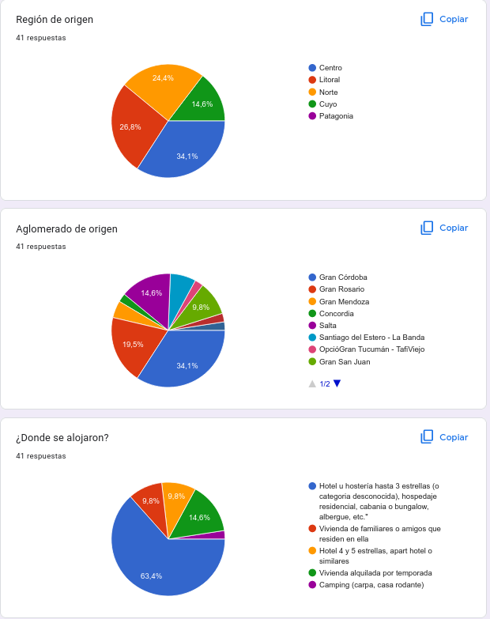
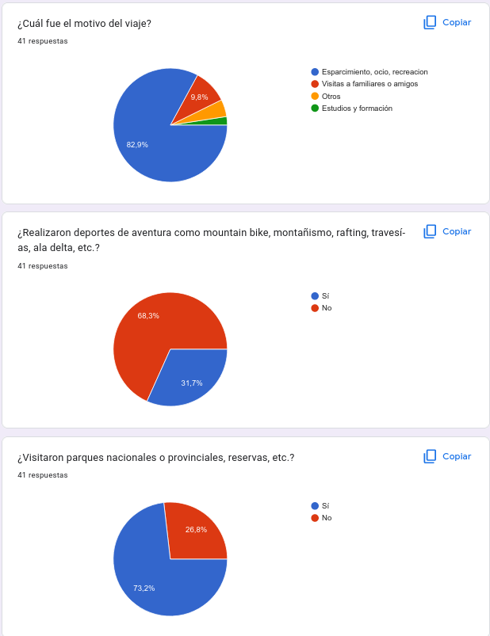

<h1 style="font-weight:normal">
 Python :snake: & Google Forms 📒
</h1>

> Simulación de una encuesta usando Python para automatizar el proceso de carga de los datos en un formulario de Google

## Tabla de contenidos

- [Recolección de datos](#recolección-de-datos)
- [Preparación del set de datos](#preparación-del-set-de-datos)
- [Generación del formulario](#generación-del-formulario)
- [Carga del formulario](#carga-del-formulario)
- [Obtención de resultados](#obtención-de-resultados)
- [Presentación](#presentación)
- [Aspectos finales](#aspectos-finales)

 

## Recolección de datos

Para poder simular los participantes de la encuesta, se obtienen datos de una fuente real, en este caso de la encuentas de viajes y turismo de hogares, disponible desde el sitio oficial de [datos de la nación](https://datos.gob.ar). 
URLs de interés:

- [Sitio Web](https://datos.gob.ar/dataset/turismo-encuesta-viajes-turismo-hogares-evyth---microdatos/archivo/turismo_645e5505-68ee-4cfa-90f9-fcc9a4a34a85)

- [Descarga CSV](http://datos.yvera.gob.ar/dataset/b5819e9b-5edf-4aad-bd39-a81158a2b3f3/resource/645e5505-68ee-4cfa-90f9-fcc9a4a34a85/download/evyth_microdatos.csv)

- [PDF informativo](http://datos.yvera.gob.ar/dataset/b5819e9b-5edf-4aad-bd39-a81158a2b3f3/resource/1b5d26f1-0ab9-4908-a44f-9ac5bd685f1b/download/evyth-data.pdf)

- [Información en TXT](https://datos.yvera.gob.ar/dataset/b5819e9b-5edf-4aad-bd39-a81158a2b3f3/resource/20e2c018-a2ee-4d97-9c67-a4303f669255/download/evyth_diccionario_registro.txt)

- [Diccionario en CSV](http://datos.yvera.gob.ar/dataset/b5819e9b-5edf-4aad-bd39-a81158a2b3f3/resource/d8107236-f5ba-428d-8a31-f9b2034d8c8f/download/evyth_diccionario_registro.csv)
        

## Preparación del set de datos

Se realiza un filtrado del dataset, para reducir el número de participantes. Se consideran solo aquellos que cumplan con lo siguiente:

- hayan viajado en el 2022
- provenientes de varias regiones y provincias, excepto de la provincia de Buenos Aires (solo por reducir el número de participantes)
- con destino a San Carlos de Bariloche
- se seleccionan 6 preguntas, de todas las realizadas en la encuesta original
ingesta_viajes.ipynb
Se obtiene una muestra de 41 participantes, algo que es de utilidad para la carga automática de las respuestas. 
Notebook: [ingesta_viajes](ingesta_viajes.ipynb)

[(Contenidos)](#tabla-de-contenidos)
 

## Generación del formulario

Se crea un [formulario de Google](https://www.google.com/forms/about/), con las 6 preguntas mencionadas, y las opciones según el dataset obtenido.
 
En este caso, la URL de interés: [encuesta](https://docs.google.com/forms/d/e/1FAIpQLSdRCqe54MSDtz3tSjjw0few6OGz0gTQ0NwnKc7Bd--FHwDyvg/viewform?usp=sf_link)

[(Contenidos)](#tabla-de-contenidos)
 

## Carga del formulario

Usando Python y Selenium, se cargan de forma automática los datos en el formulario, simulando las respuestas de los participantes, y se envían los mismos. 
Notebook: [form_selenium](form_selenium.ipynb)

[(Contenidos)](#tabla-de-contenidos)
 

## Obtención de resultados

Se muestran los gráficos (pie chart) de las encuestas, con los porcentajes de respuestas de todos los participantes.
 

 

 

De todas maneras, lo interesante es la carga de la información en una hoja de cálculo de Google, de modo que quede accesible desde cualquier parte al ser compartida, y se pueda realizar un análisis de de la información, así como la presentación de la misma.

[(Contenidos)](#tabla-de-contenidos)
 

## Presentación

(TODO)

[(Contenidos)](#tabla-de-contenidos)
 

## Aspectos finales
(TODO)

[(Contenidos)](#tabla-de-contenidos)
 
